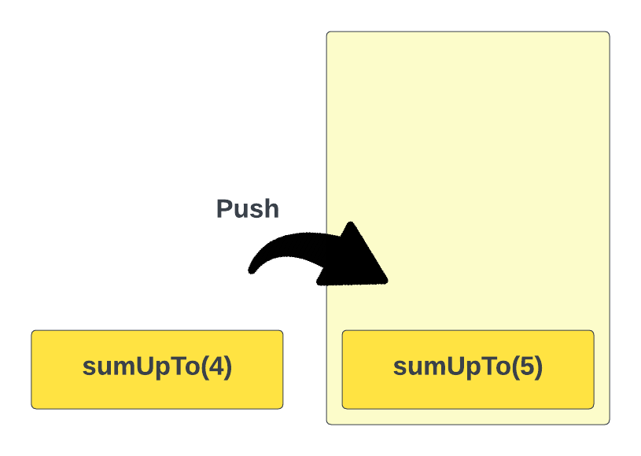
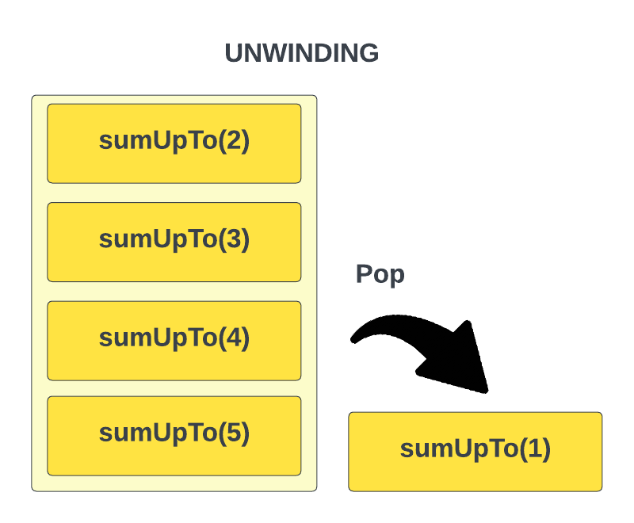

# 🔁 Unwinding (Proses Balik Rekursi)

> **Unwinding** adalah konsep kunci dalam rekursi — yaitu proses di mana fungsi mulai *mengembalikan nilai* setelah mencapai base case, dalam urutan **kebalikan** dari pemanggilan fungsinya.

---

## 📖 Pengantar

Pada pelajaran sebelumnya, kita telah membahas dasar-dasar rekursi dan melihat contoh sederhananya. Pada pelajaran ini, kita akan membahas konsep kunci dalam rekursi yang disebut **"unwinding"**.

Kita sudah tahu bahwa ketika sebuah fungsi dijalankan secara rekursif, fungsi tersebut memanggil dirinya sendiri hingga mencapai **base case**. Setelah mencapai base case itulah fungsi mulai mengembalikan nilai seiring proses *"unwinding"* rekursi berlangsung. Urutan pengembalian dari pemanggilan fungsi adalah **kebalikan** dari urutan pemanggilannya. Hal ini terjadi karena pemanggilan fungsi ditambahkan ke **call stack**, yang merupakan struktur data **LIFO** (*last in, first out* — yang terakhir masuk, pertama keluar).

Kita akan mempelajari stack dan struktur data lainnya lebih lanjut nanti — bahkan kita akan membuat implementasi stack sendiri. Namun untuk sekarang, penting untuk memahami dasarnya agar kamu bisa mengerti bagaimana rekursi dan unwinding bekerja.

---

## 🧩 Contoh: Fungsi `sumUpTo`

Mari kita lihat contoh berikut. Perhatikan fungsi ini:

```js
function sumUpTo(n) {
  if (n === 1) {
    return 1;
  }

  return n + sumUpTo(n - 1);
}
```

Fungsi ini menggunakan rekursi untuk menghitung **jumlah bilangan bulat positif** dari 1 hingga `n`. Misalnya, jika inputnya adalah `5`, fungsi harus mengembalikan `15` (1 + 2 + 3 + 4 + 5).

### 🔍 Cara Kerja Fungsi

Ketika kita memanggil `sumUpTo(5)`, ia menjalankan `sumUpTo(4) + 5`. Kemudian, `sumUpTo(4)` memanggil `sumUpTo(3) + 4`. Berlanjut, `sumUpTo(3)` memanggil `sumUpTo(2) + 3`. Pada pemanggilan berikutnya, `sumUpTo(2)` memanggil `sumUpTo(1) + 2`. Akhirnya, `sumUpTo(1)` mengembalikan nilai `1`.

Sekarang, proses **unwinding** rekursi bisa dimulai dan angka-angka dijumlahkan:

```js
sumUpTo(1) returns 1
sumUpTo(2) returns 1 + 2 = 3
sumUpTo(3) returns 1 + 2 + 3 = 6
sumUpTo(4) returns 1 + 2 + 3 + 4 = 10
sumUpTo(5) returns 1 + 2 + 3 + 4 + 5 = 15
```

Seperti yang terlihat, fungsi mulai mengembalikan nilai seiring proses *"unwinding"* rekursi. Nilai dikembalikan dalam **urutan terbalik** dari pemanggilan fungsi — itulah mengapa proses ini disebut *"unwinding"*.

---

## 📚 Melihat Call Stack

Seperti yang disebutkan sebelumnya, **call stack** adalah struktur data **LIFO** (*last in, first out*), yang berarti fungsi **terakhir** yang ditambahkan ke call stack adalah yang **pertama** dihapus. Itulah mengapa pemanggilan fungsi dikembalikan dalam urutan terbalik.

Saat pertama kali kita memanggil `sumUpTo(5)`, ia ditambahkan ke call stack. Kemudian `sumUpTo(4)` ditambahkan ke call stack, dan seterusnya...



Setelah `sumUpTo(1)` dipanggil, ia mengembalikan `1` dan dihapus dari call stack. Kemudian `sumUpTo(2)` mengembalikan `3` dan dihapus dari call stack. Proses ini berlanjut hingga `sumUpTo(5)` mengembalikan `15` dan dihapus dari call stack.



---

## 🖥️ Memvisualisasikan dengan `console.log`

Kita bisa melihat proses ini secara langsung dengan menambahkan log pada pemanggilan fungsi dan nilai yang dikembalikan:

```js
function sumUpTo(n) {
  if (n === 1) {
    console.log(`sumUpTo(${n}) returns 1`);
    return 1;
  }

  console.log(`sumUpTo(${n}) calls sumUpTo(${n - 1}) + ${n}`);
  const result = n + sumUpTo(n - 1);
  console.log(`sumUpTo(${n}) returns ${result}`);
  return result;
}
```

> 💡 **Tips:** Coba jalankan kode di atas di browser console atau Node.js untuk melihat sendiri bagaimana urutan log-nya mencerminkan proses unwinding!

### 📤 Hasil Output

Berikut adalah output yang dihasilkan saat memanggil `sumUpTo(5)`:

```
sumUpTo(5) calls sumUpTo(4) + 5
sumUpTo(4) calls sumUpTo(3) + 4
sumUpTo(3) calls sumUpTo(2) + 3
sumUpTo(2) calls sumUpTo(1) + 2
sumUpTo(1) returns 1
sumUpTo(2) returns 3
sumUpTo(3) returns 6
sumUpTo(4) returns 10
sumUpTo(5) returns 15
```

Perhatikan polanya — **4 baris pertama** menunjukkan proses rekursi *turun* hingga base case, lalu **5 baris berikutnya** menunjukkan proses unwinding *naik* kembali sambil mengembalikan nilai. Inilah visualisasi nyata dari bagaimana **call stack** bekerja!

---

## ⚠️ Memilih Base Case yang Tepat

Perhatikan test case berikut:

```js
expect(sumUpTo(0)).toBe(0);
```

Jika kita menjalankan test ini dengan implementasi awal yang base case-nya `n === 1`, fungsi akan **gagal** — bahkan menyebabkan *infinite recursion* karena `n = 0` tidak pernah memenuhi kondisi `n === 1`, sehingga rekursi terus berlanjut ke `-1`, `-2`, `-3`, ... tanpa henti. 💥

### ✅ Solusi: Gunakan `n <= 0` sebagai Base Case

```js
function sumUpTo(n) {
  if (n <= 0) {
    return 0;
  }

  return n + sumUpTo(n - 1);
}
```

Ini lebih baik karena:

- **Lebih eksplisit** — secara jelas menyatakan "jika tidak ada bilangan positif yang bisa dijumlahkan, kembalikan `0`"
- **Lebih tepat secara matematis** — jumlah bilangan positif hingga `0` memang adalah `0`
- **`n === 1` tetap ditangani dengan benar** oleh recursive case:
  ```js
  return 1 + sumUpTo(0); // sumUpTo(0) = 0, jadi hasilnya 1 ✅
  ```
- **Lebih defensif** — melindungi fungsi dari input negatif yang tidak terduga

> 💡 **Pelajaran penting:** Memilih **base case yang tepat** adalah salah satu bagian terpenting dalam menulis fungsi rekursif. Base case yang kurang lengkap bisa menyebabkan *infinite recursion* yang tidak terdeteksi sampai runtime!

---