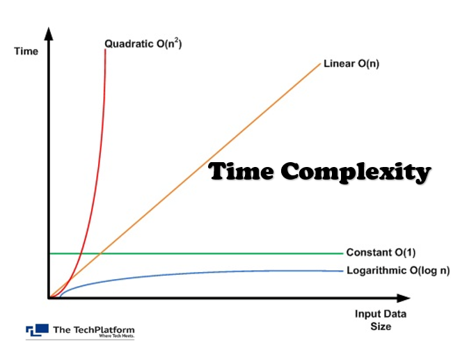

# ⏱️ Time Complexity — Panduan untuk Pemula

> Dokumentasi ini dibuat dari materi video tutorial JavaScript. Santai aja, ini buat belajar bareng!

---

## 📑 Daftar Isi

- 🤔 [Apa itu Runtime vs Time Complexity?](#runtime-vs-time-complexity)
- 🌿 [Constant Time — O(1)](#constant)
- 🟠 [Linear Time — O(n)](#linear)
- 🔴 [Quadratic Time — O(n²)](#quadratic)
- 🔵 [Logarithmic Time — O(log n)](#logarithmic)
- 🗺️ [Rangkuman](#rangkuman)
- 🔜 [Selanjutnya: Big O Notation](#bigo)

---

<a name="runtime-vs-time-complexity"></a>
## 🤔 Apa itu Runtime vs Time Complexity?

Dua istilah ini sering muncul bareng, tapi beda artinya.

**Runtime** = seberapa lama sebuah fungsi berjalan. Bisa diukur pakai detik, milidetik, dll.

**Time Complexity** = gimana runtime itu *berubah* seiring input makin besar.

> Intinya: kalau inputnya makin banyak, runtime-nya naik seberapa cepat?

Contohnya gini:
- Input 1 angka → runtime sekian
- Input 100 angka → runtime jadi berapa?
- Input 1.000.000 angka → runtime jadi berapa?

Time complexity ngasih kita **gambaran seberapa efisien** sebuah fungsi atau algoritma.

### ❓ Kenapa pakai Time Complexity, bukan langsung ukur runtime-nya aja?

Karena runtime bisa beda-beda tergantung banyak faktor:
- 💻 Hardware yang dipakai
- ⚙️ Beban sistem saat itu
- 📝 Cara fungsi ditulis

Time complexity lebih **abstrak dan konsisten** — cocok buat ngebandingin algoritma secara adil.

### 4 Tipe Utama yang Akan Kita Bahas

Di materi ini kita fokus ke 4 tipe paling umum:

1. 🌿 Constant Time
2. 🟠 Linear Time
3. 🔴 Quadratic Time
4. 🔵 Logarithmic Time



---

<a name="constant"></a>
## 🌿 Constant Time — `O(1)`

**Runtime selalu sama, berapapun besar inputnya.**

| Input | Runtime |
|-------|---------|
| 1 angka | ~sama |
| 1.000 angka | ~sama |
| 1.000.000 angka | ~sama |

Di grafik, ini kelihatan sebagai **garis lurus horizontal** — flat, nggak naik sama sekali.

✅ Ini tipe time complexity yang **paling efisien!**

⚠️ Tapi... mencapai constant time itu **jarang bisa dilakukan** karena sifat komputasi itu sendiri. Biasanya hanya terjadi pada operasi yang sangat sederhana, atau struktur data yang bisa diakses langsung dalam satu langkah.

---

<a name="linear"></a>
## 🟠 Linear Time — `O(n)`

**Runtime naik lurus sebanding dengan input.**

| Input | Runtime |
|-------|---------|
| 1 angka | 1 langkah |
| 1.000 angka | 1.000 langkah |
| 1.000.000 angka | 1.000.000 langkah |

Di grafik, ini kelihatan sebagai **garis diagonal 45°** — naik konsisten seiring input bertambah.

✅ Linear time **cukup efisien** karena pertumbuhannya 1:1.

📌 Ini adalah tipe time complexity yang **paling sering ditemui** — sekitar 95%+ dari tantangan pemrograman sehari-hari ada di sini. Dan ini lebih efisien dibanding quadratic time.

---

<a name="quadratic"></a>
## 🔴 Quadratic Time — `O(n²)`

**Runtime naik secara kuadrat dari inputnya.**

*Quadratic = fancy word untuk "dipangkat 2".*

| Input | Runtime |
|-------|---------|
| 1 | 1 langkah |
| 10 | 100 langkah |
| 100 | 10.000 langkah |

Di grafik, ini kelihatan sebagai **kurva yang melonjak tajam** — jauh lebih cepat dari linear!

❌ Ini **tidak efisien** dan sebisa mungkin harus dihindari.

> ⚠️ Tapi ya, tergantung situasi — kadang memang tidak ada pilihan lain.

---

<a name="logarithmic"></a>
## 🔵 Logarithmic Time — `O(log n)`

**Runtime naik seiring input bertambah, tapi sangat lambat.**

Di grafik, garisnya memang naik, tapi makin lama makin landai — hampir kelihatan seperti garis datar!

Fungsi atau algoritma yang pakai logarithmic time dianggap **sangat efisien**.

### 📚 Apa itu Logaritma?

Logaritma itu **kebalikan dari eksponen (pangkat)**:

| Eksponen | Logaritma |
|----------|-----------|
| 2³ = 8 | log₂(8) = **3** |
| 2⁴ = 16 | log₂(16) = **4** |
| 2⁵ = 32 | log₂(32) = **5** |

Jadi semakin besar input, kenaikan runtime-nya makin kecil dan makin lambat.

---

<a name="rangkuman"></a>
## 🗺️ Rangkuman

```
Dari paling efisien ke paling lambat:

🌿 O(1)      →  Constant     →  Flat   ─────────────
🔵 O(log n)  →  Logarithmic  →  Landai ⌒
🟠 O(n)      →  Linear       →  Diagonal /
🔴 O(n²)     →  Quadratic    →  Melonjak ↑↑
```

---

<a name="bigo"></a>
## 🔜 Selanjutnya: Big O Notation

Keempat tipe di atas cuma gambaran awal! Di materi berikutnya kita bakal masuk ke **Big O Notation** — cara standar buat mendeskripsikan time complexity sebuah fungsi, sekaligus menggambarkan batas atas dari jumlah operasi yang dilakukan algoritma relatif terhadap ukuran inputnya.

> 💡 Jangan panik kalau belum semuanya nyantol. Ini memang butuh waktu — santai aja, lanjut terus!