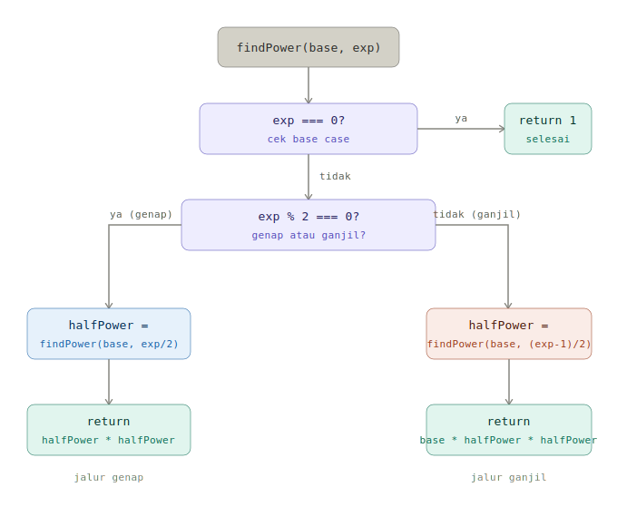
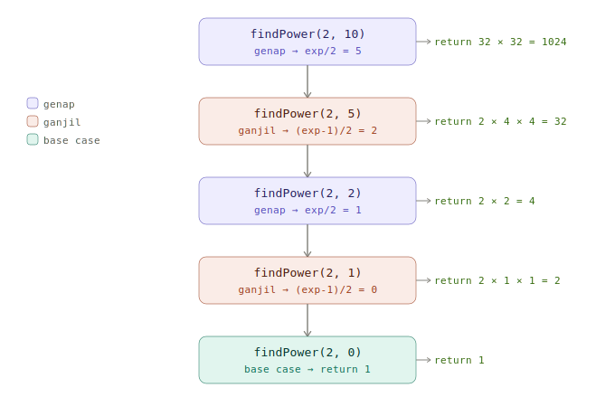

# ⚡ Logarithmic Time Complexity — `O(log n)`

> 📝 *Catatan pribadi dari video tutorial — untuk pemula yang baru mulai belajar Big O.*

---

## 📚 Daftar Isi

- 🔍 [Apa itu Logarithmic Time?](#apa-itu-logarithmic-time)
- 🏗️ [Struktur Fungsi `findPower`](#struktur-fungsi-findpower)
- 🧩 [Kasus Genap vs Ganjil](#kasus-genap-vs-ganjil)
- 🧪 [Mengukur Performa](#mengukur-performa)
- 💡 [Kenapa Ini Efisien?](#kenapa-ini-efisien)
- 🗺️ [Visualisasi](#visualisasi)

---

<a name="apa-itu-logarithmic-time"></a>
## 🔍 Apa itu Logarithmic Time?

**Logarithmic time** artinya waktu yang dibutuhkan fungsi untuk selesai **berbanding lurus dengan logaritma dari ukuran input-nya.**

Singkatnya: semakin besar input, waktu bertambah — tapi **sangat lambat** pertambahannya.

Dari semua jenis time complexity, ini termasuk yang paling efisien setelah **constant time `O(1)`**. Bedanya, constant time jarang bisa dipakai untuk banyak kasus, sedangkan logarithmic time sangat berguna di dunia nyata.

> 🧠 **Analogi simpel:** Bayangin kamu cari nama di buku telepon. Daripada baca satu-satu dari halaman pertama, kamu langsung buka tengah → buang separuh → buka tengah lagi → dst. Itu logarithmic!

---

<a name="struktur-fungsi-findpower"></a>
## 🏗️ Struktur Fungsi `findPower`

Contoh di video ini adalah fungsi **rekursif** yang menghitung hasil pangkat sebuah bilangan — `base ^ exponent`.

Fungsi ini menerima dua parameter:
- `base` → bilangan pokok (misal: `2`)
- `exponent` → pangkatnya (misal: `100`)

### Base Case — Titik Henti Rekursi

Hal pertama yang dilakukan fungsi adalah mengecek **base case**: kalau eksponennya `0`, langsung kembalikan `1`.

> Ini karena **bilangan apapun dipangkatkan nol hasilnya selalu 1.**

```js
function findPower(base, exponent) {
  // 🛑 Base case: hentikan rekursi kalau eksponen = 0
  if (exponent === 0) {
    return 1;
  }
  // ... lanjut ke kasus genap/ganjil
}
```

---

<a name="kasus-genap-vs-ganjil"></a>
## 🧩 Kasus Genap vs Ganjil

Inti dari efisiensinya ada di sini. Fungsi ini memanfaatkan satu sifat matematika:

> 💡 **Setiap bilangan yang dipangkatkan bilangan genap bisa dipecah jadi dua bagian yang sama.**
> Contoh: `2^8 = (2^4) * (2^4)`

Jadi daripada mengalikan satu per satu sampai `n` kali, kita **langsung potong jadi setengah** setiap rekursi.

### ✅ Jika Eksponen Genap

Kita simpan hasil `findPower(base, exponent / 2)` ke variabel `halfPower`, lalu kalikan `halfPower * halfPower`.

```js
  if (exponent % 2 === 0) {
    // 📌 Eksponen genap: pecah jadi dua bagian yang sama
    const halfPower = findPower(base, exponent / 2);
    return halfPower * halfPower;
  }
```

### ✅ Jika Eksponen Ganjil

Kalau ganjil, kita kurangi dulu eksponennya dengan 1 (supaya jadi genap), bagi dua, lalu kalikan hasilnya dengan `base` satu kali ekstra.

```js
  } else {
    // 📌 Eksponen ganjil: kurangi 1 dulu, baru pecah
    const halfPower = findPower(base, (exponent - 1) / 2);
    return base * halfPower * halfPower;
  }
```

### 🔄 Fungsi Lengkapnya

```js
function findPower(base, exponent) {
  if (exponent === 0) {
    return 1;
  }

  if (exponent % 2 === 0) {
    const halfPower = findPower(base, exponent / 2);
    return halfPower * halfPower;
  } else {
    const halfPower = findPower(base, (exponent - 1) / 2);
    return base * halfPower * halfPower;
  }
}
```

---

<a name="mengukur-performa"></a>
## 🧪 Mengukur Performa

Untuk membuktikan efisiensinya, kita bisa pakai `console.time()` bawaan JavaScript.

```js
// ⏱️ Tes dengan eksponen 100
console.time('Find Power 1');
findPower(2, 100);
console.timeEnd('Find Power 1');

// ⏱️ Tes dengan eksponen 1 miliar
console.time('Find Power 2');
findPower(2, 1000000000);
console.timeEnd('Find Power 2');
```

**Hasil yang didapat di video:**

| Test | Eksponen | Waktu |
|------|----------|-------|
| Find Power 1 | 100 | ~0.05 ms |
| Find Power 2 | 1.000.000.000 | ~0.009 ms |

> 😮 **Perhatikan:** eksponen **1 miliar** bahkan bisa lebih cepat dari eksponen **100**! Ini bukan bug — ini memang sifat dari algoritma logarithmic yang sudah sangat efisien, ditambah faktor hardware & cache.

---

<a name="kenapa-ini-efisien"></a>
## 💡 Kenapa Ini Efisien?

Pendekatan naif (loop biasa satu per satu) butuh **`n` langkah** untuk menghitung `base^n` → ini `O(n)`.

Dengan teknik di atas, setiap rekursi kita **memotong masalah jadi setengahnya**. Jadi untuk eksponen `1.000.000.000`, kita hanya butuh sekitar **30 langkah** (`log₂(1.000.000.000) ≈ 30`).

```
Eksponen 1.000.000.000
→ 500.000.000
→ 250.000.000
→ ...
→ 1
(hanya ~30 langkah!)
```

> ✨ Ini yang membuat `O(log n)` sangat cocok untuk data besar atau kalkulasi dengan angka-angka raksasa.

---

<a name="visualisasi"></a>
## 🗺️ Visualisasi

Tiga diagram di bawah ini membantu memahami `findPower` dari tiga sudut pandang yang berbeda.

### 1. Flowchart — Alur Logika

Menunjukkan keputusan yang diambil fungsi dari awal sampai akhir.



### 2. Pohon Rekursi — Untuk `findPower(2, 10)`

Menunjukkan bagaimana fungsi memanggil dirinya sendiri dan nilai yang dikembalikan di tiap level.



### 3. ASCII Tree — Urutan Pemanggilan & Nilai Return

Pohon di bawah menunjukkan dua fase rekursi secara bersamaan:
- **Turun** → fungsi terus memanggil dirinya sendiri sampai menyentuh base case
- **Naik** → nilai dikembalikan satu per satu ke pemanggil di atasnya

```
findPower(2, 10)                         ← genap, panggil findPower(2, 5)
└── findPower(2, 5)                      ← ganjil, panggil findPower(2, 2)
    └── findPower(2, 2)                  ← genap, panggil findPower(2, 1)
        └── findPower(2, 1)              ← ganjil, panggil findPower(2, 0)
            └── findPower(2, 0)          ← BASE CASE → return 1
            ↑ halfPower = 1
            return 2 × 1 × 1 = 2        ← findPower(2, 1) selesai
        ↑ halfPower = 2
        return 2 × 2 = 4                ← findPower(2, 2) selesai
    ↑ halfPower = 4
    return 2 × 4 × 4 = 32              ← findPower(2, 5) selesai
↑ halfPower = 32
return 32 × 32 = 1024                  ← findPower(2, 10) selesai ✓
```

> 💡 Perhatikan arah panahnya — `↑` menandai nilai `halfPower` yang baru saja naik dari bawah, lalu langsung dipakai untuk menghitung hasil di baris berikutnya.

### 4. Trace Table — Nilai di Tiap Langkah

Menunjukkan angka-angka nyata yang terjadi selama rekursi berjalan.

| Level | Pemanggilan | Tipe | `halfPower` | Hasil yang dikembalikan |
|-------|-------------|------|-------------|------------------------|
| 0 | `findPower(2, 10)` | genap | 32 | `32 × 32 = 1024` |
| 1 | `findPower(2, 5)` | ganjil | 4 | `2 × 4 × 4 = 32` |
| 2 | `findPower(2, 2)` | genap | 2 | `2 × 2 = 4` |
| 3 | `findPower(2, 1)` | ganjil | 1 | `2 × 1 × 1 = 2` |
| 4 | `findPower(2, 0)` | base case | — | `1` |

> 💡 Baca tabel dari **bawah ke atas** — rekursi turun dulu ke level paling dalam, baru nilai dikembalikan ke atas satu per satu.

---

*Selanjutnya: **Space Complexity** 🚀*