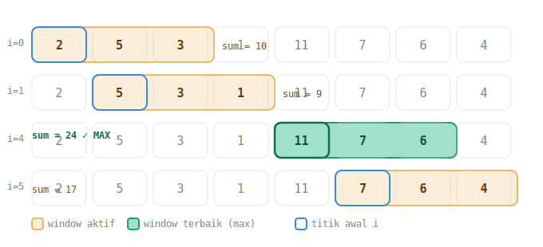
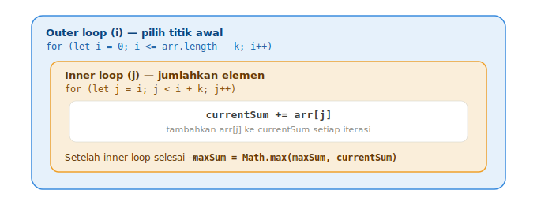
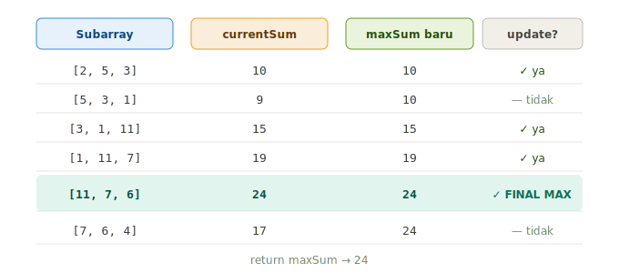

# 📚 Dokumentasi Belajar: Maximum Subarray Sum

> _Catatan pribadi dari video tutorial — ditulis ulang biar lebih gampang dipahami_

---

## 🗂️ Daftar Isi

- 🔍 [Apa itu Maximum Subarray Sum?](#apa-itu-maximum-subarray-sum)
- 🧩 [Konsep Subarray](#konsep-subarray)
- ⚙️ [Solusi O(n²) dengan Nested Loop](#solusi-on2-dengan-nested-loop)
- 🔄 [Cara Kerja Loop-nya](#cara-kerja-loop-nya)
- ➕ [Menghitung dan Membandingkan Sum](#menghitung-dan-membandingkan-sum)
- ⚠️ [Jebakan: Angka Negatif](#jebakan-angka-negatif)
- ✅ [Kode Lengkap](#kode-lengkap)
- 🚀 [Selanjutnya: Sliding Window](#selanjutnya-sliding-window)

---

<a name="apa-itu-maximum-subarray-sum"></a>
## 🔍 Apa itu Maximum Subarray Sum?

Ini adalah tantangan untuk **mencari total penjumlahan terbesar** dari serangkaian angka yang berurutan di dalam sebuah array.

Fungsinya menerima dua input:
- **`arr`** → array berisi integer (boleh negatif)
- **`k`** → panjang subarray yang ingin kita jumlahkan (antara 1 sampai panjang array)

```javascript
maxSubarraySum([2, 5, 3, 1, 11, 7, 6, 4], 3); // Output: 24
```

---

<a name="konsep-subarray"></a>
## 🧩 Konsep Subarray

**Subarray** = potongan array yang **berurutan/bersebelahan**. Bukan angka acak yang dipilih sembarangan!

Misalnya, dari array `[2, 5, 3, 1, 11, 7, 6, 4]` dengan `k = 3`, subarray yang valid adalah:

| Subarray | Jumlah |
|----------|--------|
| `[2, 5, 3]` | 10 |
| `[5, 3, 1]` | 9 |
| `[3, 1, 11]` | 15 |
| `[1, 11, 7]` | 19 |
| `[11, 7, 6]` | **24** ✅ |
| `[7, 6, 4]` | 17 |

Yang kita cari adalah **24** — jumlah terbesar dari semua kemungkinan subarray.

> 💡 **Ingat:** `[2, 11, 6]` itu **bukan** subarray yang valid karena angka-angkanya tidak bersebelahan di array asli.

**Visualisasi pergerakan window (k=3):**



---

<a name="solusi-on2-dengan-nested-loop"></a>
## ⚙️ Solusi O(n²) dengan Nested Loop

Solusi ini menggunakan **dua loop bertumpuk (nested loop)**. Cara kerjanya sederhana tapi tidak efisien karena kompleksitasnya adalah **O(n²)** — artinya makin panjang array, makin banyak pekerjaan yang dilakukan secara kuadrat.

> 📌 Solusi ini sengaja dibuat dulu sebagai fondasi. Nanti akan di-refactor menggunakan **Sliding Window** agar lebih efisien (O(n)).

Strukturnya seperti ini:

```javascript
function maxSubarraySum(arr, k) {
  let maxSum = -Infinity; // 👈 ini penting, lihat bagian "Jebakan" di bawah

  for (let i = 0; i <= arr.length - k; i++) {   // outer loop
    let currentSum = 0;

    for (let j = i; j < i + k; j++) {           // inner loop
      currentSum += arr[j];
    }

    maxSum = Math.max(maxSum, currentSum);
  }

  return maxSum;
}
```

---

<a name="cara-kerja-loop-nya"></a>
## 🔄 Cara Kerja Loop-nya

### 🔵 Outer Loop (loop `i`)

Loop ini bertugas **memilih titik awal** setiap subarray.

```javascript
for (let i = 0; i <= arr.length - k; i++)
```

Kenapa batasnya `arr.length - k`? Karena kalau `i` sudah terlalu jauh ke kanan, tidak ada cukup elemen untuk membentuk subarray sepanjang `k`.

Contoh: array punya 8 elemen, `k = 3` → `i` hanya boleh sampai `8 - 3 = 5` (index ke-5).

**Visualisasi struktur nested loop:**



### 🟢 Inner Loop (loop `j`)

Loop ini bertugas **menjumlahkan elemen** dalam subarray yang dimulai dari index `i`.

```javascript
for (let j = i; j < i + k; j++)
```

- `j` mulai dari posisi yang sama dengan `i`
- `j` berjalan sampai `i + k` (tidak termasuk)
- Setiap iterasi: tambahkan `arr[j]` ke `currentSum`

**Simulasi** untuk `i = 4` (subarray `[11, 7, 6]`):

```
j = 4 → arr[4] = 11 → currentSum = 11
j = 5 → arr[5] = 7  → currentSum = 18
j = 6 → arr[6] = 6  → currentSum = 24
```

---

<a name="menghitung-dan-membandingkan-sum"></a>
## ➕ Menghitung dan Membandingkan Sum

Setelah inner loop selesai (satu subarray sudah dijumlahkan), kita bandingkan `currentSum` dengan `maxSum` yang tersimpan. Yang lebih besar yang disimpan.

Ada **dua cara** untuk melakukan ini, keduanya valid dan hasilnya sama persis:

### Cara 1 — `if` statement (eksplisit) 🔎

```javascript
if (sum > maxSum) {
  maxSum = sum;
}
```

Logikanya tertulis jelas: _"kalau `sum` lebih besar dari `maxSum` yang ada sekarang, baru timpa nilainya."_ Lebih mudah dibaca untuk pemula karena alurnya kelihatan langsung.

### Cara 2 — `Math.max()` (ringkas) ⚡

```javascript
maxSum = Math.max(maxSum, currentSum);
```

`Math.max()` adalah fungsi bawaan JavaScript yang langsung mengembalikan nilai terbesar dari argumen yang dimasukkan. Lebih singkat, tapi menyembunyikan logika perbandingannya di balik fungsi.

### 📊 Perbandingan

| | `if` statement | `Math.max()` |
|---|---|---|
| **Keterbacaan** | Eksplisit, mudah dilacak | Ringkas, perlu tahu fungsinya |
| **Hasil** | Sama ✅ | Sama ✅ |
| **Kapan pakai?** | Saat belajar / butuh kejelasan | Saat sudah familiar, kode lebih bersih |

> 💡 Tidak ada yang lebih "benar" — ini murni soal gaya penulisan (*style*). Di kode lengkap bawah dipakai `Math.max()`, tapi kamu bebas ganti ke `if` statement kalau lebih nyaman.

**Visualisasi perbandingan maxSum di setiap iterasi:**



---

<a name="jebakan-angka-negatif"></a>
## ⚠️ Jebakan: Angka Negatif

Kalau kita set `maxSum = 0` di awal, ada masalah saat **semua angka di array bernilai negatif**.

```javascript
// ❌ Bermasalah untuk array negatif
let maxSum = 0;

maxSubarraySum([-2, -5, -3, -1], 4); // Harusnya -11, tapi kode mengembalikan 0!
```

Kenapa salah? Karena `0` tidak pernah akan "kalah" dari angka negatif, jadi `maxSum` tidak pernah ter-update.

### ✅ Solusinya: gunakan `-Infinity`

```javascript
let maxSum = -Infinity;
```

Dengan nilai awal `-Infinity`, **semua angka pasti lebih besar** dari nilai ini — termasuk angka negatif sekalipun. Ini menjamin bahwa subarray pertama yang ditemui langsung masuk sebagai `maxSum`.

---

<a name="kode-lengkap"></a>
## ✅ Kode Lengkap

```javascript
function maxSubarraySum(arr, k) {
  // Inisialisasi dengan -Infinity agar aman untuk array negatif
  let maxSum = -Infinity;

  // Outer loop: iterasi titik awal subarray
  for (let i = 0; i <= arr.length - k; i++) {
    let currentSum = 0;

    // Inner loop: jumlahkan elemen dalam subarray sepanjang k
    for (let j = i; j < i + k; j++) {
      currentSum += arr[j];
    }

    // Update maxSum jika currentSum lebih besar
    maxSum = Math.max(maxSum, currentSum);
  }

  return maxSum;
}

module.exports = maxSubarraySum;
```

### 🧪 Test Cases

```javascript
maxSubarraySum([2, 5, 3, 1, 11, 7, 6, 4], 3);
// → 24  (dari subarray [11, 7, 6])

maxSubarraySum([-2, -5, -3, -1, -11, -7, -6, -4], 4);
// → -9  (dari subarray [-1, -11, ...] — yang paling "tidak negatif")
```

---

<a name="selanjutnya-sliding-window"></a>
## 🚀 Selanjutnya: Sliding Window

Solusi di atas bekerja, tapi **tidak efisien**. Kompleksitas **O(n²)** artinya kita menghitung ulang hampir semua elemen di setiap iterasi — boros!

Di video berikutnya akan dipelajari teknik **Sliding Window** yang:
- Kompleksitasnya **O(n)** (linear — jauh lebih cepat!)
- Tidak perlu inner loop lagi
- Prinsipnya: "geser jendela" — kurangi elemen yang keluar, tambah elemen yang masuk

> 🪟 Bayangkan seperti jendela yang bergeser ke kanan: kita tidak perlu menjumlahkan ulang dari nol, cukup update selisihnya saja.

---

_Dokumentasi ini dibuat berdasarkan video tutorial JavaScript — Traversy Media / Brad Traversy style challenge series._