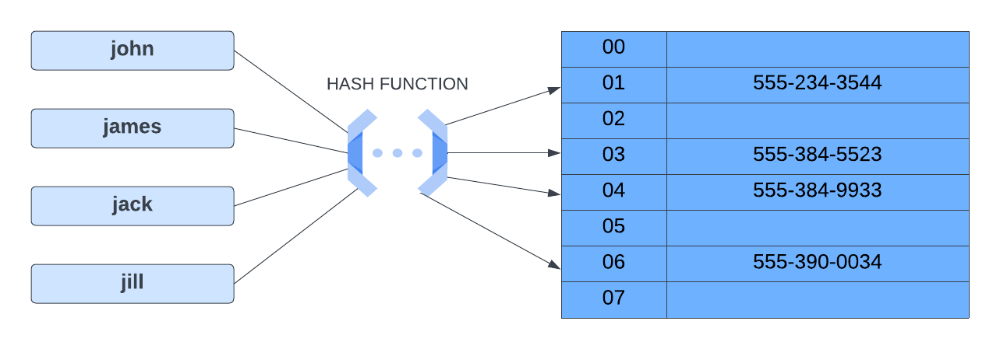

# 🗂️ Hash Table (Hash Map)

> 📌 *Catatan pribadi dari video tutorial — bagian Data Structures*

---

## 📋 Daftar Isi

- 🔍 [Apa itu Hash Table?](#apa-itu-hash-table)
- ⚙️ [Hash Function](#hash-function)
- 💥 [Hash Collision](#hash-collision)
- 🟨 [Hash Table di JavaScript](#hash-table-di-javascript)
- ⏱️ [Time & Space Complexity](#time--space-complexity)
- 🛠️ [Metode-Metode Hash Table](#metode-metode-hash-table)

---

<a name="apa-itu-hash-table"></a>
## 🔍 Apa itu Hash Table?

**Hash table** (atau *hash map*) adalah sebuah struktur data yang bisa menyimpan data dalam bentuk pasangan **key → value**.

Bayangkan seperti buku telepon:
- **Key** = nama orang
- **Value** = nomor teleponnya

Cara kerja hash table itu unik — dia nggak langsung nyimpan datanya secara berurutan. Sebaliknya, dia pakai sesuatu yang namanya **hash function** untuk menentukan *di mana* data itu harus disimpan dalam sebuah array. Tempat-tempat penyimpanan itu disebut **bucket** atau **slot**.

### Visualisasi



Dari gambar di atas:
- **Kiri** → Key berupa nama: `john`, `james`, `jack`, `jill`
- **Tengah** → Hash Function yang memproses setiap key
- **Kanan** → Array (bucket) yang menyimpan nomor telepon berdasarkan index

Contohnya, `john` diproses oleh hash function dan menghasilkan index `01`, sehingga nomor telepon john (`555-234-3544`) disimpan di slot nomor `01`.

---

<a name="hash-function"></a>
## ⚙️ Hash Function

**Hash function** adalah fungsi yang bertugas:
1. Menerima sebuah **key** sebagai input
2. Mengembalikan sebuah **index** (angka) sebagai output

Index itulah yang dipakai untuk menentukan di slot mana key-value pair akan disimpan.

> 💡 **Aturan penting:** Hash function **harus selalu mengembalikan index yang sama** untuk key yang sama. Jadi kalau kamu masukin key `"john"`, dia harus *selalu* balik ke index yang sama setiap kali dipanggil.

---

<a name="hash-collision"></a>
## 💥 Hash Collision

Kadang ada masalah yang namanya **hash collision** — ini terjadi ketika **dua key yang berbeda menghasilkan index yang sama**.

Misalnya, `jack` dan `jill` sama-sama menghasilkan index `03` → tabrakan!

### Cara Mencegahnya

Hash function yang **bagus** akan mendistribusikan key secara merata ke seluruh array, sehingga:
- ✅ Collision diminimalkan
- ✅ Performa hash table tetap cepat

Kalau terlalu banyak collision, performa bisa menurun — yang tadinya `O(1)` bisa jadi `O(n)`. Ini akan dibahas lebih lanjut di bagian kompleksitas.

---

<a name="hash-table-di-javascript"></a>
## 🟨 Hash Table di JavaScript

Di JavaScript, sebenarnya sudah ada beberapa struktur bawaan yang menggunakan hash table di balik layar:

| Struktur | Keterangan |
|----------|------------|
| **Object** `{}` | Ini sendiri adalah hash table! Data disimpan sebagai key-value pair |
| **Map** | Struktur data khusus yang lebih fleksibel dari Object |
| **Set** | Mirip Map, tapi hanya menyimpan nilai unik (tanpa value) |

Kita akan coba dulu beberapa latihan menggunakan `Map` dan `Set`, sebelum nantinya kita bikin **hash table sendiri dari nol** — lengkap dengan class dan method-methodnya.

---

<a name="time--space-complexity"></a>
## ⏱️ Time & Space Complexity

Hash table terkenal karena **sangat cepat** untuk pencarian data!

### Rata-rata (tanpa collision)

| Operasi | Time Complexity | Space Complexity |
|---------|----------------|-----------------|
| Access  | `O(1)` ⚡      | `O(n)`          |
| Search  | `O(1)` ⚡      | `O(n)`          |
| Insertion | `O(1)` ⚡    | `O(n)`          |
| Deletion | `O(1)` ⚡     | `O(n)`          |

> ⚠️ **Catatan:** Kalau terjadi banyak collision, time complexity bisa turun ke `O(n)` alias linear — artinya semakin banyak data, semakin lambat.

### Kenapa Space Complexity = O(n)?

Karena kita harus menyimpan **semua key dan value** di dalam hash table. Semakin banyak data yang disimpan, semakin besar memori yang dibutuhkan — jadi ukurannya **berbanding lurus** dengan jumlah key-value pair.

---

<a name="metode-metode-hash-table"></a>
## 🛠️ Metode-Metode Hash Table

Ini adalah method-method yang umum dimiliki oleh sebuah hash table:

### `set(key, value)` — Tambah Data
Menambahkan pasangan key-value ke dalam hash table.
```js
hashTable.set("john", "555-234-3544")
```

---

### `get(key)` — Ambil Data
Mengembalikan value yang terkait dengan key yang kamu cari.
```js
hashTable.get("john") // → "555-234-3544"
```

---

### `remove(key)` — Hapus Data
Menghapus pasangan key-value berdasarkan key yang diberikan.
```js
hashTable.remove("john")
```

---

### `has(key)` — Cek Keberadaan Key
Mengecek apakah sebuah key ada di dalam hash table. Mengembalikan `true` atau `false`.
```js
hashTable.has("john") // → true atau false
```

---

### `keys()` — Ambil Semua Key
Mengembalikan array berisi semua key yang ada di hash table.
```js
hashTable.keys() // → ["john", "james", "jack", "jill"]
```

---

### `values()` — Ambil Semua Value
Mengembalikan array berisi semua value yang ada di hash table.
```js
hashTable.values() // → ["555-234-3544", "555-384-5523", ...]
```

---

> 🚀 **Selanjutnya:** Kita akan latihan dulu menggunakan `Map` dan `Set` bawaan JavaScript, lalu membuat class `HashTable` sendiri dari nol!
