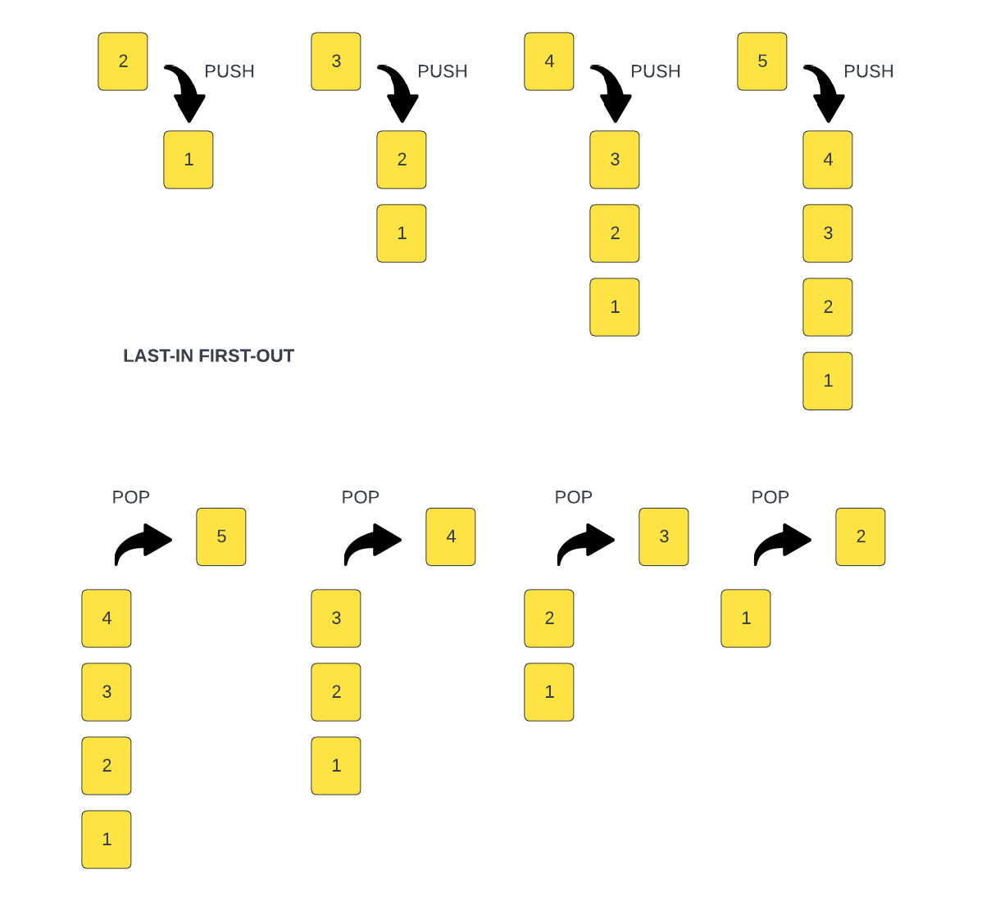

# 📚 Apa itu Stack?

## 📑 Daftar Isi

- 📦 [Apa itu Stack?](#apa-itu-stack)
- 🔄 [Cara Kerja Stack (LIFO)](#cara-kerja-stack-lifo)
- 🍽️ [Analogi: Tumpukan Piring](#analogi-tumpukan-piring)
- ⬆️ [Push & Pop — Operasi Dasar Stack](#push--pop--operasi-dasar-stack)
- 📞 [Contoh Nyata: Call Stack](#contoh-nyata-call-stack)
- 🔜 [Selanjutnya](#selanjutnya)

---

<a name="apa-itu-stack"></a>

## 📦 Apa itu Stack?

**Stack** adalah **linear data structure** — artinya data tersusun dalam satu baris/garis lurus, bukan bercabang ke mana-mana.

Yang bikin Stack spesial adalah **cara kerjanya yang sangat spesifik**: data yang **terakhir masuk** akan jadi yang **pertama keluar**. Prinsip ini disebut **LIFO** (**L**ast **I**n, **F**irst **O**ut).

> 💡 Jangan terintimidasi sama istilah "data structure" ya! Konsep Stack ini sebenarnya **sangat sederhana** — kalau kamu paham cara menumpuk piring, kamu sudah paham Stack! 😄

---

<a name="cara-kerja-stack-lifo"></a>

## 🔄 Cara Kerja Stack (LIFO)

**LIFO = Last In, First Out** — Yang terakhir masuk, yang pertama keluar.

Ini artinya:
- ✅ Elemen yang **paling terakhir ditambahkan** ke stack akan menjadi elemen yang **pertama kali dikeluarkan**
- ❌ Kamu **tidak bisa** langsung mengambil elemen di tengah atau di bawah — harus dari **atas** dulu!

---

<a name="analogi-tumpukan-piring"></a>

## 🍽️ Analogi: Tumpukan Piring

Cara termudah memahami Stack? Bayangkan **tumpukan piring makan**! 🍽️

```
    ┌─────────┐
    │ Piring 5 │  ← piring terakhir ditaruh, pertama diambil
    ├─────────┤
    │ Piring 4 │
    ├─────────┤
    │ Piring 3 │
    ├─────────┤
    │ Piring 2 │
    ├─────────┤
    │ Piring 1 │  ← piring pertama ditaruh, terakhir diambil
    └─────────┘
```

- Piring terakhir yang kamu **taruh di atas** tumpukan → akan jadi piring **pertama yang kamu ambil**
- Kamu nggak bisa langsung ambil piring yang di bawah tanpa mengangkat yang di atasnya dulu

**Sesimpel itu konsep Stack!** 🎉

---

<a name="push--pop--operasi-dasar-stack"></a>

## ⬆️ Push & Pop — Operasi Dasar Stack

Stack punya **dua operasi utama** dengan istilah khusus:

| Operasi | Istilah | Artinya |
|---------|---------|---------|
| ➕ Menambah elemen | **`push`** | Menaruh elemen **di atas** stack |
| ➖ Mengeluarkan elemen | **`pop`** | Mengambil elemen **dari atas** stack |

### 🎬 Visualisasi Step-by-Step

Perhatikan gambar berikut:



**Proses Push (menambahkan):**

```
Mulai:   Push 2:   Push 3:   Push 4:   Push 5:
┌───┐    ┌───┐     ┌───┐     ┌───┐     ┌───┐
│ 1 │    │ 2 │     │ 3 │     │ 4 │     │ 5 │ ← TOP
└───┘    ├───┤     ├───┤     ├───┤     ├───┤
         │ 1 │     │ 2 │     │ 3 │     │ 4 │
         └───┘     ├───┤     ├───┤     ├───┤
                   │ 1 │     │ 2 │     │ 3 │
                   └───┘     ├───┤     ├───┤
                             │ 1 │     │ 2 │
                             └───┘     ├───┤
                                       │ 1 │
                                       └───┘
```

**Proses Pop (mengeluarkan):**

Ingat prinsip **LIFO** — yang terakhir masuk, pertama keluar!

```
Pop 5:   Pop 4:   Pop 3:   Pop 2:   Pop 1:
┌───┐    ┌───┐     ┌───┐     ┌───┐
│ 4 │    │ 3 │     │ 2 │     │ 1 │    (kosong)
├───┤    ├───┤     ├───┤     └───┘
│ 3 │    │ 2 │     │ 1 │
├───┤    ├───┤     └───┘
│ 2 │    │ 1 │
├───┤    └───┘
│ 1 │
└───┘
```

> 🔑 **Ingat:** `push` = taruh di atas, `pop` = ambil dari atas. Simpel!

---

<a name="contoh-nyata-call-stack"></a>

## 📞 Contoh Nyata: Call Stack

Salah satu contoh penggunaan Stack di dunia nyata yang paling penting adalah **Call Stack**.

**Call Stack** adalah konsep fundamental dalam programming yang berfungsi sebagai **execution context untuk pemanggilan fungsi**. Setiap kali sebuah fungsi dipanggil, fungsi tersebut **di-push ke atas call stack**. Ketika fungsi selesai dijalankan, ia **di-pop dari stack**.

Ini sangat berkaitan dengan **rekursi** — setiap kali fungsi memanggil dirinya sendiri secara rekursif, pemanggilan baru tersebut **ditambahkan ke atas stack**. Makanya kalau rekursi terlalu dalam, kita bisa mendapat error **"Stack Overflow"**! 💥

```
Contoh Call Stack saat fungsi dipanggil:

    ┌──────────────┐
    │  fungsiC()   │  ← sedang dieksekusi (paling atas)
    ├──────────────┤
    │  fungsiB()   │  ← menunggu fungsiC selesai
    ├──────────────┤
    │  fungsiA()   │  ← menunggu fungsiB selesai
    ├──────────────┤
    │   main()     │  ← menunggu fungsiA selesai
    └──────────────┘
```

> 💡 Di JavaScript, kamu bisa melihat Call Stack di **browser dev tools** saat debugging!

---

<a name="selanjutnya"></a>

## 🔜 Selanjutnya

Di video berikutnya, kita akan **membuat class Stack sendiri** di mana kita bisa:
- 📥 **Push** — menambahkan elemen ke stack
- 📤 **Pop** — mengeluarkan elemen dari stack
- 🧩 Menyelesaikan **challenges** menggunakan implementasi Stack tersebut

Implementasinya memang sedikit lebih menantang dari konsepnya, tapi dengan pemahaman dasar yang sudah kita punya, pasti bisa! 💪
