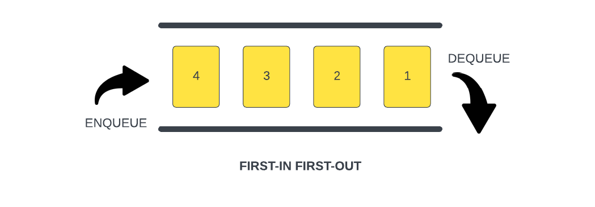
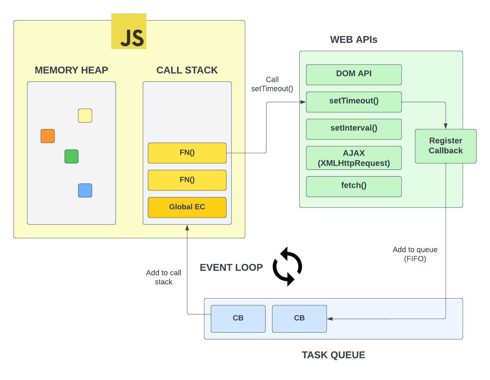

# 📋 Queue (Antrean)

> Sebuah `queue` adalah struktur data linear yang bekerja dengan prinsip **First In, First Out** atau **FIFO**. Ini berarti elemen pertama yang ditambahkan ke dalam `queue` akan menjadi elemen pertama yang dihapus dari `queue`.

---

## 🚀 Apa itu Queue?

Bayangkan sebuah **antrean di kasir supermarket**. Orang pertama yang berdiri di barisan akan menjadi orang pertama yang dilayani dan selesai.

### 🖼️ Ilustrasi Konsep


### 📟 Visualisasi ASCII — Prinsip FIFO

```text
          ENQUEUE (Masuk)                          DEQUEUE (Keluar)
              │                                         │
              ▼                                         ▼
     ╔════════════════════════════════════════════════════════╗
     ║   [ Baru ]  →  [ 4 ]  [ 3 ]  [ 2 ]  [ 1 ]  → [ Keluar ] ║
     ╚════════════════════════════════════════════════════════╝
          REAR                                      FRONT
       (Belakang)                                  (Depan)

                    ◄── FIRST IN, FIRST OUT ──►
```

Saat kita **menambahkan** elemen ke dalam antrean, kita menggunakan istilah **`enqueue`**.
Saat kita **menghapus** elemen dari antrean, kita menggunakan istilah **`dequeue`**.

### 🔢 Visualisasi Langkah-per-Langkah

```text
Langkah 1 ─ enqueue(1)
  REAR → [ 1 ] ← FRONT
         ═══════

Langkah 2 ─ enqueue(2)
  REAR → [ 2 ]  [ 1 ] ← FRONT
         ══════════════

Langkah 3 ─ enqueue(3)
  REAR → [ 3 ]  [ 2 ]  [ 1 ] ← FRONT
         ═════════════════════

Langkah 4 ─ dequeue() → mengeluarkan 1 ✅
  REAR → [ 3 ]  [ 2 ] ← FRONT          │ 1 │ → keluar
         ══════════════                  └───┘

Langkah 5 ─ dequeue() → mengeluarkan 2 ✅
  REAR → [ 3 ] ← FRONT                 │ 2 │ → keluar
         ═══════                        └───┘

Langkah 6 ─ dequeue() → mengeluarkan 3 ✅
  (queue kosong)                        │ 3 │ → keluar
                                        └───┘

  Urutan keluar: 1 → 2 → 3  (sama dengan urutan masuk = FIFO ✓)
```

**Alur Kerja:**
* Kita mulai dengan `queue` yang memiliki elemen berlabel 1.
* Kita melakukan `enqueue` elemen lain berlabel 2, lalu label 3, dan seterusnya.
* Dalam hal ini, elemen pertama yang dimasukkan adalah **1**.
* Maka, elemen **1** jugalah yang pertama kali dikeluarkan saat kita melakukan `dequeue`. Setelah itu baru 2, kemudian 3, dan seterusnya.

---

## 💻 Implementasi dalam JavaScript

Dalam JavaScript, objek **`Array`** memiliki method **`push`** dan **`shift`** yang bisa kita gunakan untuk mensimulasikan perilaku `queue`:
*   **`push()`**: Berfungsi sebagai `enqueue` — menambah elemen ke **belakang** antrean.
*   **`shift()`**: Berfungsi sebagai `dequeue` — mengambil elemen dari **depan** antrean.

Kita juga bisa membuat custom `class` sendiri yang secara khusus hanya menyediakan method `enqueue` dan `dequeue` untuk menjaga integritas struktur data tersebut.

---

## 🔄 Contoh Nyata: Event Loop

Salah satu contoh penggunaan `queue` yang paling fundamental dalam JavaScript adalah **Event Loop**. `event loop` berfungsi sebagai sebuah **`message queue`**.

### 🖼️ Arsitektur JavaScript Runtime


### 📟 Visualisasi ASCII — Arsitektur Event Loop

```text
  ┌─────────────────────────────────────────────────────────────────┐
  │                     JAVASCRIPT RUNTIME                          │
  │                                                                 │
  │  ┌──────────────┐    ┌──────────────┐     ┌─────────────────┐  │
  │  │  MEMORY HEAP │    │  CALL STACK  │     │    WEB APIs     │  │
  │  │              │    │ ┌──────────┐ │     │                 │  │
  │  │  ┌──┐ ┌──┐   │    │ │   FN()   │ │ ──► │  setTimeout()   │  │
  │  │  └──┘ └──┘   │    │ ├──────────┤ │     │  setInterval()  │  │
  │  │  ┌──┐        │    │ │   FN()   │ │     │  fetch()        │  │
  │  │  └──┘        │    │ ├──────────┤ │     │  DOM API        │  │
  │  │              │    │ │ Global EC│ │     │                 │  │
  │  │              │    │ └──────────┘ │     └────────┬────────┘  │
  │  └──────────────┘    └──────▲───────┘              │           │
  │                             │                      │           │
  │                    Eksekusi │          Callback     │           │
  │                             │          selesai      │           │
  │                    ┌────────┴──────────────┐        │           │
  │                    │     EVENT LOOP  🔄    │        │           │
  │                    │  (Cek: stack kosong?) │        │           │
  │                    └────────▲──────────────┘        │           │
  │                             │                      │           │
  │               ┌─────────────┴─────────────────┐    │           │
  │               │      TASK QUEUE (FIFO)        │◄───┘           │
  │               │  ┌────┐  ┌────┐  ┌────┐       │               │
  │               │  │ CB │  │ CB │  │ CB │ ◄── masuk              │
  │               │  └────┘  └────┘  └────┘       │               │
  │               │  keluar ──►                   │               │
  │               └───────────────────────────────┘               │
  └─────────────────────────────────────────────────────────────────┘
```

Diagram di atas menunjukkan seluruh ekosistem *runtime* JavaScript:
*   **`call stack`**: Struktur data **stack** yang melacak pemanggilan fungsi sesuai urutan dan mengatur eksekusi serta pengembalian nilai (*return*).
*   **Web APIs**: Lingkungan browser yang menangani operasi *asynchronous* seperti `setTimeout()`, `fetch()`, dan `DOM API`.
*   **Task Queue**: Antrean **FIFO** tempat *callback* dari Web APIs menunggu giliran untuk dieksekusi.
*   **`event loop`**: Mekanisme yang **terus-menerus memeriksa** apakah `call stack` sudah kosong. Jika kosong, ia memindahkan *callback* dari `task queue` ke `call stack` untuk dieksekusi.

---

> [!TIP]
> Penjelasan mendalam mengenai topik ini tersedia di kursus **Modern JS From the Beginning** dan seri YouTube **"JavaScript: Under The Hood"**. Materi ini memberikan gambaran jelas bagaimana `queue` digunakan dalam mekanisme internal JavaScript engine.
